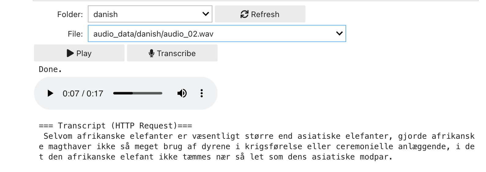
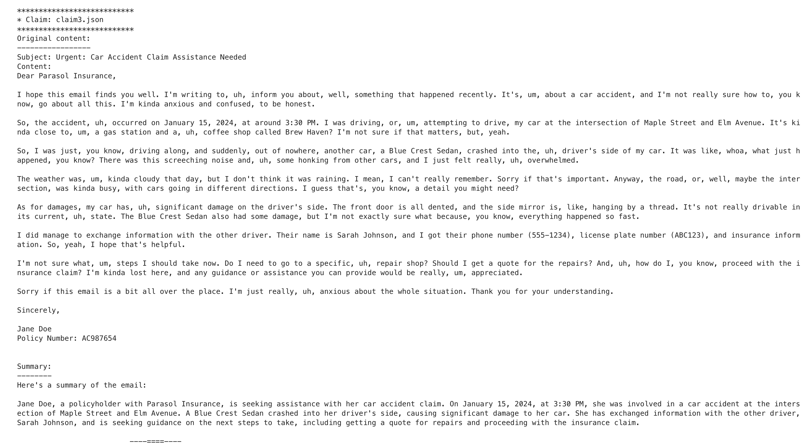
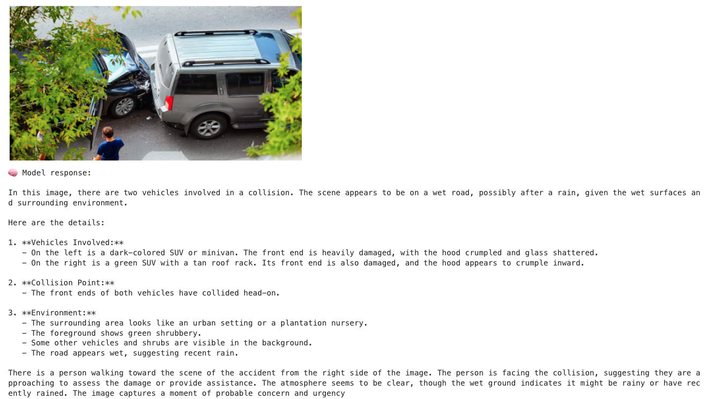
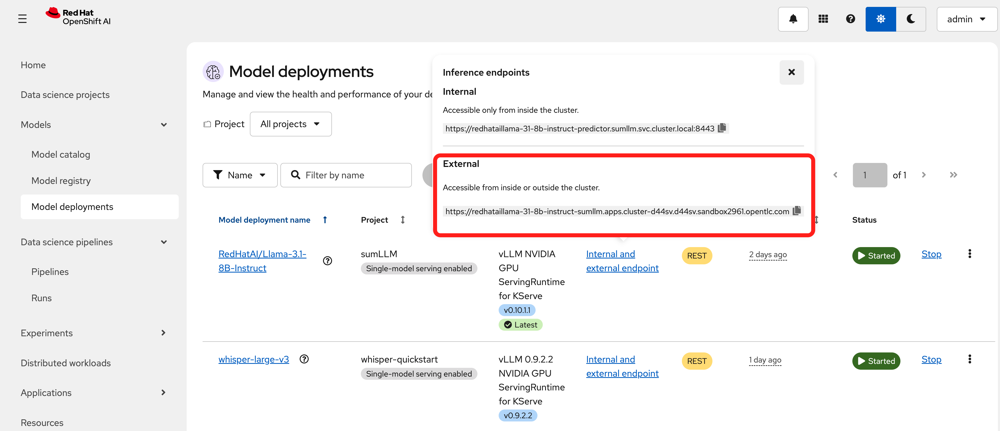

# Project POC AROS

A proof-of-concept project demonstrating speech-to-text and text summarization capabilities using models deployed on OpenShift AI with vLLM serving runtime.

## Project Structure

### 📁 `audio_data/`
Contains audio samples for testing speech-to-text models:
- **`english/`** - English audio samples (9 files)
- **`danish/`** - Danish audio samples (5 files)

### 📁 `sample_emails/`
Insurance claims examples for testing summarization model:
- `claim1.json`, `claim2.json`, `claim3.json` - Sample insurance claim data

## Installation

Deploy both Whisper and Mistral models to your OpenShift AI cluster using the Helm chart.

### Prerequisites

- OpenShift cluster with OpenShift AI/RHOAI installed
- Helm 3.x installed
- `kubectl` or `oc` CLI configured
- GPU nodes available in your cluster
- Access to model registries:
  - `quay.io/redhat-ai-services` (for Whisper)
  - `registry.redhat.io/rhelai1` (for Mistral)

### Deploy from Packaged Chart

```bash
# Install the Helm chart
helm install proj-poc-aros proj-poc-aros-1.0.0.tgz \
  -n proj-poc-aros \
  --create-namespace
```

### Deploy from Source

```bash
# Install from the helm directory
helm install proj-poc-aros ./helm \
  -n proj-poc-aros \
  --create-namespace
```

### Selective Model Deployment

By default, both Whisper and Mistral models are deployed. You can selectively enable/disable each model using the `enabled` flag:

```bash
# Deploy only Whisper (speech-to-text)
helm install proj-poc-aros ./helm \
  -n proj-poc-aros \
  --create-namespace \
  --set mistral.enabled=false

# Deploy only Mistral (text summarization)
helm install proj-poc-aros ./helm \
  -n proj-poc-aros \
  --create-namespace \
  --set whisper.enabled=false
```

### Uninstall

```bash
helm uninstall proj-poc-aros -n proj-poc-aros

oc delete namespace proj-poc-aros
```

## Authentication

Both models are deployed with **token authentication** enabled for secure access to external endpoints.

**Quick Start:**
```bash
# Extract token
TOKEN=$(kubectl get secret whisper-large-v3-sa-token -n proj-poc-aros \
  -o jsonpath='{.data.token}' | base64 -d)

# Use in API calls
curl -H "Authorization: Bearer $TOKEN" https://your-endpoint/v1/models
```

📖 **Detailed Guide:** See [troubleshooting/TOKEN_SETUP.md](troubleshooting/TOKEN_SETUP.md) for complete token setup and usage instructions.

🔧 **Troubleshooting:** See [troubleshooting/FIX_AUTH_ERROR.md](troubleshooting/FIX_AUTH_ERROR.md) if you encounter authentication errors.


## Notebooks

### Speech-to-Text Testing
- **`whisper_http_only_transcription.ipynb`** - Transcribe English and Danish audio using HTTP endpoints
- **`whisper_openai_client.ipynb`** - Transcribe audio using OpenAI-compatible client




### Text Summarization Testing
- **`summarization.ipynb`** - Test summarization model with sample insurance claims



### Image-to-Text (Multimodal) Testing
- **`image-to-text.ipynb`** - Generate natural language descriptions from images using the Mistral multimodal model



## Deployment

Two models are deployed in OpenShift AI cluster with vLLM as serving runtime:
- Speech-to-text model: Whisper-large-v3
- Text summarization model: Llama-3.1-8B-Instruct-quantized.w4a16

> **Note**:  we replaced the text summarization model to 'Mistral-Small-3.1-24B-Instruct-2503-quantized.w4a16' for better performance on Danish data.

Both models support internal and external endpoint access. **External URLs are pre-populated in the whisper notebooks.**



> **Note**: API KEY required for external endpoint access.

## Usage

1. **Audio Transcription**: Run either whisper notebook with audio samples from `audio_data/`
2. **Text Summarization**: Run `summarization.ipynb` with sample emails from `sample_emails/`
3. **Image Description**: Run `image-to-text.ipynb` with image from assets/images/image-to-text.png''


